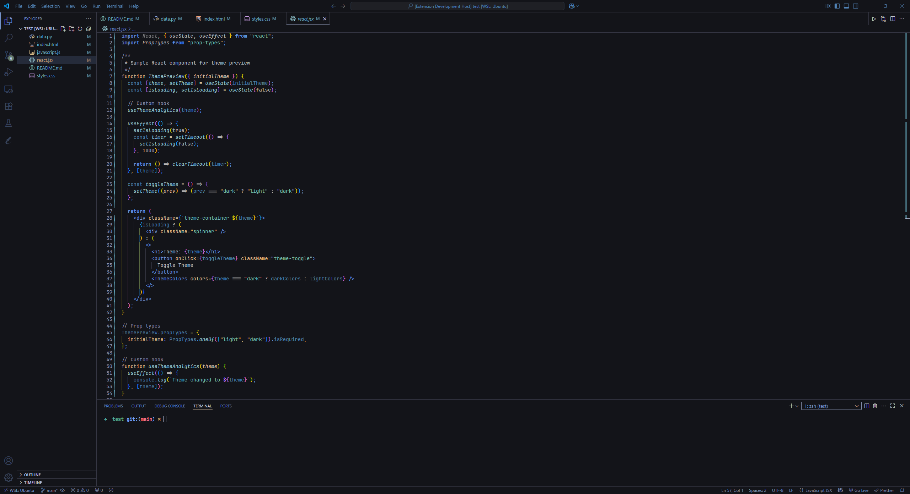

# midnight-koi 

a tranquil and calming theme designed for developers who prefer a dark interface while coding. This theme aims to reduce eye strain and enhance focus, providing a peaceful coding environment.

### Features

- Calming Color Palette: Soft colors that are easy on the eyes.
- Syntax Highlighting: Clear and distinct highlighting for various programming languages.
- Minimalistic Design: A clean and uncluttered interface to help you concentrate on your code.
- Customizable: Easily adjustable settings to fit your personal preferences.

### Customization

You can further customize the theme by modifying your settings in settings.json. For example, you can adjust the font size, line height, and other editor settings to enhance your experience.

## React example

## Javascript Example

## Python Example

## HTML Example

## CSS Example

## README Example
